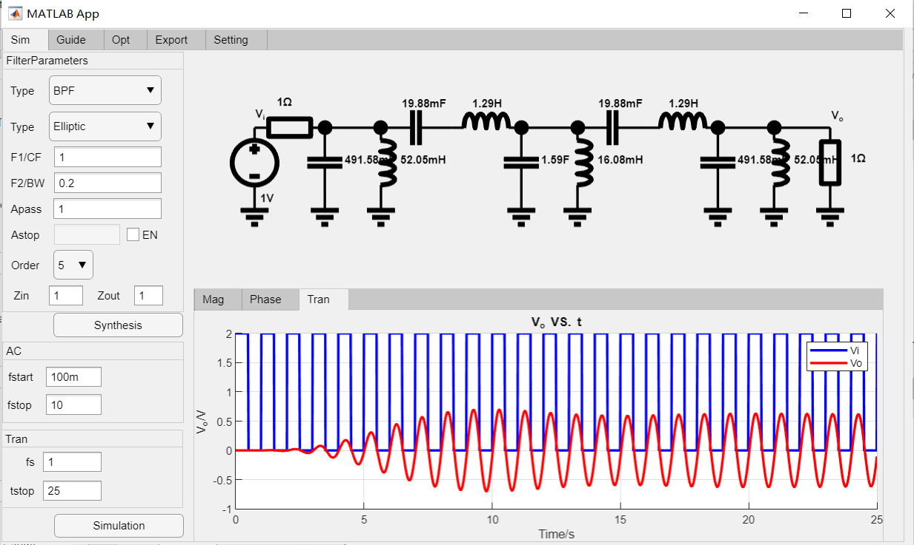

# 
# Matlab滤波器设计APP(MatlabFilterDesignApp)
> 这是一个Matlab版本滤波器设计APP，目的是为了进行无源滤波器设计，更多可以关注微信公众号"[电路设计小工具](https://mp.weixin.qq.com/s/fxfEnir-hU0YvF9_CWyI6g)".

### 如何使用(how to use)
下载整个文件包： \
 \
顶层文件(Top file)： \
eToolsFilterDesignApp.mlapp

### 运行环境(Env)
win10, Matlab2021a

### 程序结构

更多技术细节可以参考$^{[1][2][3][4]}$

### 运行效果(demo)

5阶巴特沃斯带通滤波器综合和仿真

### 参考(ref)
[1] : [模拟无源滤波器设计（一）](https://mp.weixin.qq.com/s/wNRHyBHpimjU90bymHp7JA) \
[2] : [模拟无源滤波器设计（二）](https://mp.weixin.qq.com/s/3GMQs4WDm683tdAXqyoOgQ) \
[3] : [模拟无源滤波器设计（三）](https://mp.weixin.qq.com/s/nZFx7weLcO-WRKLbP0T4jQ) \
[4] : [模拟无源滤波器设计（四）](https://mp.weixin.qq.com/s/mllwGShvbh3TWdFRbp9LhQ) \
[5] : [欢迎关注电路设计小工具公众号](https://mp.weixin.qq.com/s/fxfEnir-hU0YvF9_CWyI6g) \
[6] : [Matlab源码地址](https://github.com/etools361/PassiveNetworkSimEngine)
